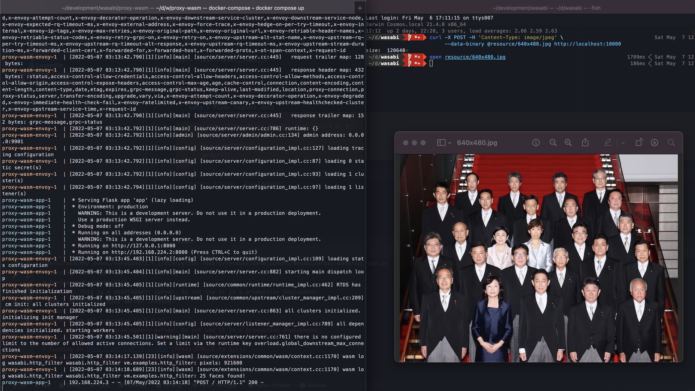

# wasabi

## Run

Before building, you need to get the onnx file.

```shell
curl "https://raw.githubusercontent.com/Star-Clouds/CenterFace/master/models/onnx/centerface.onnx" \
	 	-o resource/centerface.onnx --create-dirs
```

### Simple detection (just a program of rust)

```shell
cargo run --package wasabi --bin detect image.jpg
```

### Run in browser (wasm)
https://hayashikun.github.io/wasabi/
```shell
cd web
npm run dev
```


### Run in envoy-proxy (wasm)
```shell
cd proxy-wasm
cargo build --release -p proxy-wasm --target wasm32-unknown-unknown
docker-compose up
```



Only JPEG image (640x480 px) is supported.
